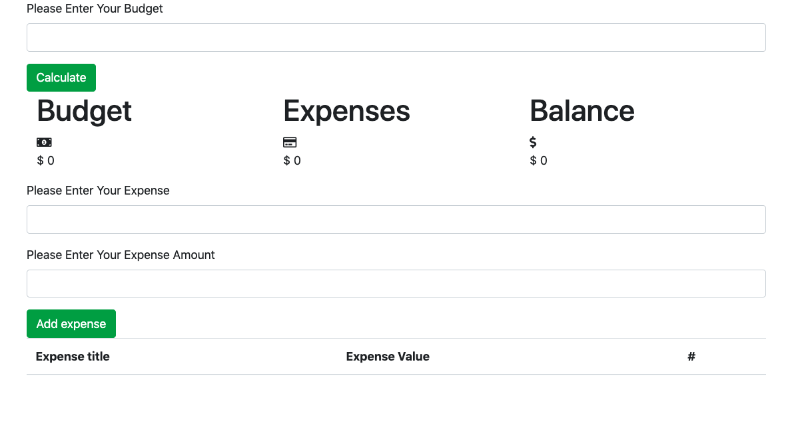

# Passo a passo do desenvolvimento do Budget App

- Criei a pasta para o projeto
- Dentro da pasta iniciei um projeto node com `npm init`
- Adicionei o `Parcel` para realizar o bundler do projeto: `yarn add parcel-bundler --dev`
- Criei uma pasta `src` na raiz do projeto e coloquei um `index.html`
- No arquivo `index.html` coloquei um codigo html base
- Coloquei um arquivo `index.js`
- inseri um `console.log("Hello")` dentro do arquivo `index.js`
- Importei o arquivo `index.js` dentro do `index.html`
- Criei um script para o parcel: `"dev": "parcel src/*.html",`
- Rodei o script
- criei a seguinte estrutura padrão baseada no seguinte design

  

- No arquivo `index.js` criei a classe UI e selecionei todos os elementos

```js
const $ = document.querySelector.bind(document);

class UI {
  constructor() {
    this.budgetFeedback = $("#budget-feedback");
    this.expenseFeedback = $("#expense-feedback");

    //Budget Form
    this.budgetForm = $("#budget-form");
    this.budgetInput = $("#budget-input");

    //Values
    this.budgetValue = $("#budget-value");
    this.expenseValue = $("#expense-value");
    this.balanceValue = $("#balance-value");

    //Expense Form
    this.expenseForm = $("#expense-form");
    this.expenseInput = $("#expense-input");
    this.amountInput = $("#amount-input");

    //Expense table
    this.expenseTable = $("#expense-table");

    this.itemList = [];
    this.itemId = 0;
  }
}
```

- Depois da classe UI foi adicionado o codigo dos listeners

```js
function eventListeners() {
  const budgetForm = $("#budget-form");
  const expenseForm = $("#expense-form");
  const expenseTable = $("#expense-table");
  const ui = new UI();

  budgetForm.addEventListener("submit", event => {
    event.preventDefault();
    console.log("submit budget");
  });

  expenseForm.addEventListener("submit", event => {
    event.preventDefault();
    console.log("submit expense");
  });
}

document.addEventListener("DOMContentLoaded", function() {
  // Your code to run since DOM is loaded and ready
  console.log("document loaded");
  eventListeners();
});
```

- Removi o conteudo e as classes de ambas as divs de feeback

```html
<div class="alert" id="expense-feedback" role="alert"></div>
```

- Dentro da classe UI crie a funcao que manipula o submit do form de budget com a lógica para verificar e mostrar o feedback

```js
  submitBudgetForm() {
    const value = this.budgetInput.value;

    if (value === "" || value < 0) {
      this.budgetFeedback.classList.add("alert-danger", "show");
      this.budgetFeedback.innerHTML = "<span>Valor não pode ser vazio ou negativo</span>";

      setTimeout(() => {
        this.budgetFeedback.classList.add("fade");
        this.budgetFeedback.classList.remove("alert-danger");
        this.budgetFeedback.innerHTML = "";
      }, 3000);
    }
  }
```

- Chamei dentro do listener do budget form a função

```js
budgetForm.addEventListener("submit", event => {
  event.preventDefault();
  console.log("submit budget");
  ui.submitBudgetForm();
});
```

- Fiz a lógica para adicionar o valor no budget quando for sucesso

```js
this.budgetFeedback.classList.add("alert-success", "show");
this.budgetFeedback.innerHTML = "<span>Valor adicionado com sucesso</span>";
this.budgetInput.value = "";
this.budgetValue.textContent = `$ ${value}`;

setTimeout(() => {
  this.budgetFeedback.classList.add("fade");
  this.budgetFeedback.classList.remove("alert-success");
  this.budgetFeedback.innerHTML = "";
}, 3000);
```

- Para adcionar o valor no balance criei o método que retorna, no primeiro momento um valor mock, o valor total de expense

```js
  totalExpense() {
    let total = 400;
    return total;
  }
```

- Editei o submitBudgetForm para chamar um outro metodo antes de adicionar o valor do budget

```js
...
    this.budgetInput.value = "";
    this.showBalance(value);

    timer = setTimeout(() => {
...s
```

- Criei o método showBalance que faz a adição do valor total no balance e troca a classe de acordo com o valor

```js
  showBalance(budgetValue) {
    const expense = this.totalExpense();
    const total = budgetValue - expense;
    this.budgetValue.textContent = `$ ${budgetValue}`;

    if (total < 0) {
      this.balanceValue.classList.remove("text-success", "text-secondary");
      this.balanceValue.classList.add("text-danger");
      this.balanceValue.textContent = `$ ${total}`;
      return;
    }

    if (total > 0) {
      this.balanceValue.classList.remove("text-danger", "text-secondary");
      this.balanceValue.classList.add("text-success");
      this.balanceValue.textContent = `$ ${total}`;
      return;
    }

    this.balanceValue.classList.remove("text-success", "text-danger");
    this.balanceValue.classList.add("text-secondary");
    this.balanceValue.textContent = `$ ${total}`;
  }
```

- Dentro da classe UI crie a funcao que manipula o submit do form de budget com a lógica para verificar e mostrar o feedback

```js
  submitExpenseForm() {
    const expenseValue = this.expenseInput.value;
    const amountValue = this.amountInput.value;

    if (expenseValue === "" || amountValue === "" || amountValue < 0) {
      this.expenseFeedback.classList.remove("alert-success");
      this.expenseFeedback.classList.add("alert-danger", "show");
      this.expenseFeedback.innerHTML =
        "<span>Valor não pode ser vazio ou negativo</span>";

      timer = setTimeout(() => {
        this.expenseFeedback.classList.add("fade");
        this.expenseFeedback.classList.remove("alert-danger");
        this.expenseFeedback.innerHTML = "";
      }, 3000);

      return;
    }
  }
```

- Chamei dentro do listener do budget form a função

```js
expenseForm.addEventListener("submit", event => {
  event.preventDefault();
  console.log("submit expense");
  ui.submitExpenseForm();
});
```

- Fiz a lógica para adicionar o valor no itemList quando for sucesso

```js
this.expenseFeedback.classList.remove("alert-danger");
this.expenseFeedback.classList.add("alert-success", "show");
this.expenseFeedback.innerHTML = "<span>Valor adicionado com sucesso</span>";
this.expenseInput.value = "";
this.amountInput.value = "";

const expense = {
  id: this.itemId,
  expense: expenseValue,
  amount: parseInt(amountValue)
};
this.itemId++;
this.itemList.push(expense);

timer = setTimeout(() => {
  this.budgetFeedback.classList.add("fade");
  this.budgetFeedback.classList.remove("alert-success");
  this.budgetFeedback.innerHTML = "";
}, 3000);
```

- O metodo de adicionar o expense na lista

```js
  addExpense() {
    this.expenseTable.lastElementChild.innerHTML = `
      ${this.itemList
        .map(
          expense => `

          <tr>
              <td>${expense.expense}</td>
              <td>${expense.amount}</td>
          </tr>

      `
        )
        .join("")}
    `;
  }
```

- E a chamada dele logo apos ter adicionado no itemList

```js
this.itemId++;
this.itemList.push(expense);
this.addExpense();
```
