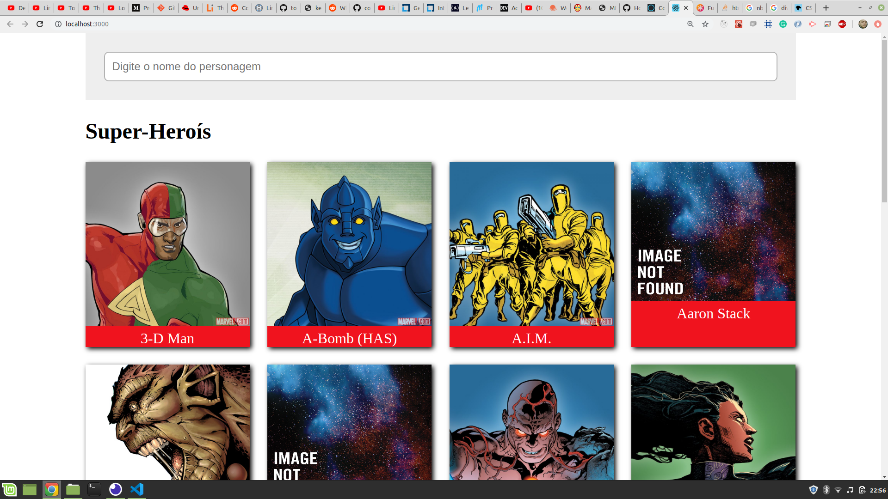
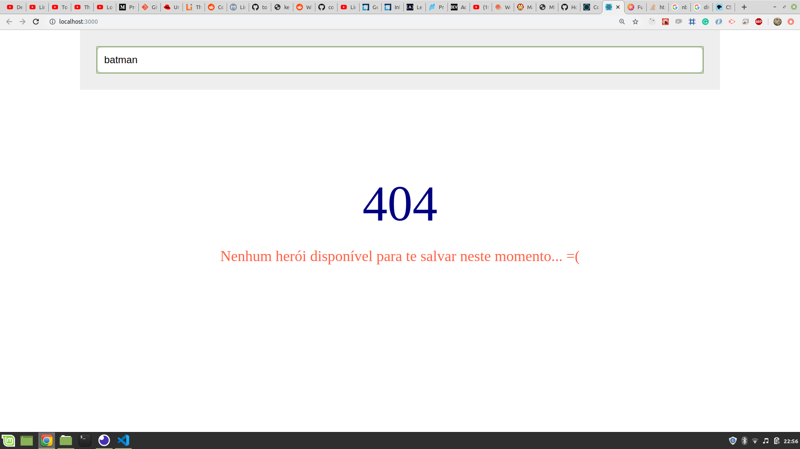

# Marvel List

Este projeto consome as apis da marvel.com

O projeto foi iniciado utilizando o `create-react-app`




## Iniciando o projeto

Primeiramente delete quase tudo de dentro da `src`, deixe somente o `index.js` e a `App.js`. Arrume os código de ambos os arquivos.
E rode o `yarn start`, o código deve rodar sem erros.

## Api

Crie a pasta `api` dentro da pasta `src`. Dentro dela crie o arquivo `api.js` e insira o código a seguir.
Criei a variável API_KEY e MD5 a partir das suas credenciais.
A API_KEY e a PRIVATE_KEY voce encontra no dashboard da sua conta da marvel ()
Para criar a MD5 pode usar o seguinte site: http://www.md5.cz/
Nele cole os valores da TIMESTAMP(que pode ser gerada pela formula Math.floor(Date.now() / 1000) no console), da PRIVATE_KEY e da API_KEY(chave pública)

```js
const URL = "http://gateway.marvel.com/v1/public";
const TIMESTAMP = "1581718777"; // Math.floor(Date.now() / 1000)

export const fetchCharacters = async () => {
  const response = await fetch(
    `${URL}/characters?ts=${TIMESTAMP}&apikey=${API_KEY}&hash=${MD5}`
  );

  return response.json();
};
```

E importe este arquivo dentro da `App.js`

```js
import React from "react";
import { fetchCharacters } from "./api/api";

function App() {
  React.useEffect(() => {
    fetchCharacters().then(console.log);
  }, []);

  return <div>Heelo</div>;
}

export default App;
```

Rode o código e veja que no console esta sendo mostrada os valores de retorno da api

## Desenvolvendo a tela de listagem

A tela de listagem deve mostrar uma lista dos personagens da marvel. Para não precisar ficar lendo sempre os dados da api criamos um dado fake a partir do primeiro resultado da api

Este resultado iremos armazenar dentro da pasta `src/data` no arquivo `characters.json`

```json
{
  "results": [
    {
      "id": 1011334,
      "name": "3-D Man",
      "description": "",
      "modified": "2014-04-29T14:18:17-0400",
      "thumbnail": {
        "path": "http://i.annihil.us/u/prod/marvel/i/mg/c/e0/535fecbbb9784",
        "extension": "jpg"
      },
      "resourceURI": "http://gateway.marvel.com/v1/public/characters/1011334",
      "comics": {},
      "series": {},
      "events": {},
      "urls": []
    }
  ]
}
```

### Primeira versão

A primeira versão é para testar se a leitura dos dados e a exibição dos mesmos estão corretos na tela. Também serve para estruturar a base da aplicação

```jsx
import React from "react";
// import { fetchCharacters } from "./api/api";
import data from "./data/characters.json";

function App() {
  const [heroes, setHeroes] = React.useState([]);
  React.useEffect(() => {
    setHeroes(data.results);
  }, []);

  return (
    <div>
      {/** Componente Container */}
      <section>
        {/** Componente Header */}
        <div>
          {/** Componente Search */}
          <input type="text" placeholder="Digite o nome do personagem" />
        </div>
      </section>
      <section>
        {/** Componente HeroesList */}
        <h1>Heróis</h1> {/** Componente Title */}
        <div>
          {heroes.map(heroe => (
            <div key={heroe.id}>
              {/** Componente Heroe */}
              <div>
                
              </div>
              <div>{heroe.name}</div>
            </div>
          ))}
        </div>
      </section>
    </div>
  );
}

export default App;
```

## Componentizando

A partir da `App.js` foram criados os componentes: `Container`, `Header`, `Heroe`, `HeroesList`, `Input`, `Title`

Código da `App.js`

```jsx
import React from "react";
// import { fetchCharacters } from "./api/api";
import Container from "./components/Container";
import Header from "./components/Header";
import HeroesList from "./components/HeroesList";
import data from "./data/characters.json";
import "./App.css";

function App() {
  const [heroes, setHeroes] = React.useState([]);
  React.useEffect(() => {
    setHeroes(data.results);
  }, []);

  return (
    <Container>
      <Header />
      <HeroesList heroes={heroes} />
    </Container>
  );
}

export default App;
```

## Fazendo a busca

Aumente a quantidade de herois dentro do `characters.json`.
A busca se trata de ver se o valor digitado no input existe como nome de algum personagem, logo este valor deve ser do state da `App.js` e deve possuir um handler para ele
O input e o setInput são variaveis do state da App. A função handleChangeInput recebe o evento de quando o usuário digita, define este valor no state do input com o setInput e logo após faz um filtro dos dados que estão no json e define este novo array como os novos heroes.

```jsx
import React from "react";
// import { fetchCharacters } from "./api/api";
import Container from "./components/Container";
import Header from "./components/Header";
import HeroesList from "./components/HeroesList";
import data from "./data/characters.json";
import "./App.css";

function App() {
  const [heroes, setHeroes] = React.useState([]);
  const [input, setInput] = React.useState("");
  React.useEffect(() => {
    setHeroes(data.results);
  }, []);

  const handleChangeInput = event => {
    const { value } = event.target;
    setInput(value);

    const newHeroes = data.results.filter(h =>
      h.name.toLowerCase().includes(value.toLowerCase())
    );

    setHeroes(newHeroes);
  };

  return (
    <Container>
      <Header input={input} onChange={handleChangeInput} />
      <HeroesList heroes={heroes} />
    </Container>
  );
}

export default App;
```

## Criando um debounce

Para não ficar filtrando enquanto o usuário esta digitando podemos usar um debounce.
Um debounce é basicamente um tempo definido para realizar uma função, poré se esta função for chamada enquanto o tempo não terminou ele recomeça a contagem e não chama a função.

```jsx
import React from "react";
// import { fetchCharacters } from "./api/api";
import Container from "./components/Container";
import Header from "./components/Header";
import HeroesList from "./components/HeroesList";
import data from "./data/characters.json";
import "./App.css";

let timer = null;

function App() {
  const [heroes, setHeroes] = React.useState([]);
  const [input, setInput] = React.useState("");
  React.useEffect(() => {
    setHeroes(data.results);
  }, []);

  const handleChangeInput = event => {
    const { value } = event.target;
    setInput(value);

    clearTimeout(timer);
    timer = setTimeout(() => {
      const newHeroes = data.results.filter(h =>
        h.name.toLowerCase().includes(value.toLowerCase())
      );

      setHeroes(newHeroes);
    }, 500);
  };

  return (
    <Container>
      <Header input={input} onChange={handleChangeInput} />
      <HeroesList heroes={heroes} />
    </Container>
  );
}

export default App;
```

## Definindo busca não encontrada

A busca não encontrada é o array de heroes vazio. O componente `NotFound` foi criado para este caso.

```jsx
{
  heroes.length ? <HeroesList heroes={heroes} /> : <NotFound />;
}
```

## Consumindo a api

Agora que ja se tem todas as telas definidas e os dados sendo lidos, a leitura dos dados da api fica extremamente simples

Trocamos a leitura do dado dos `characters.json` pelo fetch na api na montagem do elemento

```jsx
React.useEffect(() => {
  fetchCharacters()
    .then(response => setHeroes(response.data.results))
    .catch(e => {
      console.log(e);
      setHeroes([]);
    });
}, []);
```

No arquivo da `api.js` criamos uma nova função para pegar os dados pelo nome

```jsx
export const fetchCharactersByName = async name => {
  try {
    const response = await fetch(
      `${URL}/characters?ts=${TIMESTAMP}&apikey=${API_KEY}&hash=${MD5}&nameStartsWith=${name}`
    );

    return response.json();
  } catch (e) {
    throw Error("Erro na busca por nome");
  }
};
```

Importamos esta função na `App.js` e utilizamos ela quando o usuário para de digitar. Assim que ele termina a digitção a api é chamada com aquele ultimo valor do input.

```jsx
const handleChangeInput = event => {
  const { value } = event.target;
  setInput(value);

  clearTimeout(timer);
  timer = setTimeout(() => {
    fetchCharactersByName(value)
      .then(response => setHeroes(response.data.results))
      .catch(e => {
        console.log(e);
        setHeroes([]);
      });
  }, 500);
};
```

## Validando a busca

Para validar a busca basta criar um state para caso a busca de erro, passar este state para o input mostrar ou não o erro. O erro é verificado assim que o usuário digita alguma coisa, ou seja, na `handleChangeInput`

Lendo o erro no `Input.js`, se tiver um erro coloca uma borda vermelha e mostra a mensagem do erro

```jsx
import React from "react";
import "./Input.css";

export default function Input({ value, onChange, error }) {
  const hasError = Boolean(error);
  const errorStyle = hasError ? { borderColor: "red" } : {};
  return (
    <div className="input-group">
      <input
        type="text"
        placeholder="Digite o nome do personagem"
        value={value}
        onChange={onChange}
        style={errorStyle}
      />
      {hasError && <span className="error">{error}</span>}
    </div>
  );
}
```

Validando a entrada na handleChangeInput, se tiver alguma entrada que não seja válida, devolve a mensagem para o state

```jsx
const validate = value => {
  if (value === "") {
    return "Valor não pode ser vazio";
  }
  if (value.includes("@")) {
    return "Valor não pode conter caracteres especiais";
  }

  return;
};

const handleChangeInput = event => {
  const { value } = event.target;
  setInput(value);
  setError(validate(value));

  clearTimeout(timer);
  timer = setTimeout(() => {
    fetchCharactersByName(value)
      .then(response => setHeroes(response.data.results))
      .catch(e => {
        console.log(e);
        setHeroes([]);
      });
  }, 500);
};
```
